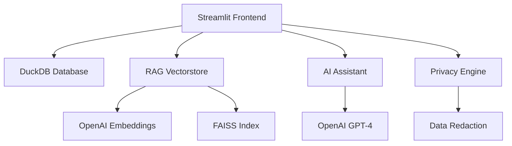

# 💰 Advanced Spending Insights & Budgeting

[](https://python.org)
[](https://streamlit.io)
[](https://openai.com)
[](LICENSE)

> **AI-powered financial analytics dashboard with real-time insights, RAG-based queries, and advanced visualizations**

## ✨ Features

### 🎯 Core Functionality
- **Real-time Financial Dashboard** - Interactive Streamlit interface with live data updates
- **AI-Powered Insights** - RAG (Retrieval-Augmented Generation) queries using OpenAI GPT models
- **Advanced Analytics** - Financial health scoring, spending pattern analysis, and predictive insights
- **Smart Budget Management** - Intelligent alerts, budget tracking, and optimization suggestions
- **Performance Monitoring** - Real-time metrics, caching, and optimization features

### 📊 Visualizations
- **Interactive Charts** - Plotly-powered dynamic visualizations
- **Spending Heatmaps** - Category vs day-of-week spending patterns  
- **Budget Analysis** - Multi-panel budget status and projections
- **Merchant Analytics** - Top merchant analysis with frequency vs amount bubble charts
- **Trend Analysis** - Monthly spending trends and comparative analytics

### 🤖 AI & Machine Learning
- **Vector Search** - FAISS-powered semantic search of financial transactions
- **Smart Categorization** - Automatic spending category suggestions
- **Predictive Analytics** - Budget projection and spending forecasting
- **Natural Language Queries** - Ask questions about your spending in plain English
- **Context-Aware Responses** - AI responses tailored to your financial context

### 🔒 Privacy & Security
- **Data Redaction** - Multi-level sensitive information protection
- **Local Processing** - All data processed locally with DuckDB
- **Configurable Privacy** - Adjustable redaction levels (Low/Medium/High)
- **Secure Caching** - Encrypted vectorstore caching with TTL

## 🚀 Quick Start

### Prerequisites
- Python 3.10 or higher
- OpenAI API key
- [uv](https://github.com/astral-sh/uv) (recommended) or pip

### Quick Start with Management Script

We provide a comprehensive management script (`manage.sh`) for easy project setup and deployment:

```bash
# Initial setup (creates virtual env, directories, .env file)
./manage.sh setup

# Install dependencies
./manage.sh install

# Start development server
./manage.sh dev

# Check application status
./manage.sh status

# View all available commands
./manage.sh help
```

### Manual Installation

1. **Clone the repository**
```bash
git clone https://github.com/rahultube3/gen-ai-projects.git
cd gen-ai-projects/spending-insights-budgeting
```

2. **Install dependencies**
```bash
# Using uv (recommended)
uv sync

# Or using pip
pip install -r requirements.txt
```

3. **Set up environment variables**
```bash
cp .env.example .env
# Edit .env and add your OpenAI API key
```

4. **Initialize the database**
```bash
uv run python db_setup.py
```

5. **Run the application**
```bash
uv run streamlit run streamlit_app.py
```

The application will be available at `http://localhost:8501`

### 🎯 Management Script Features

The `manage.sh` script provides comprehensive project management:

**Core Commands:**
- `./manage.sh setup` - Initial project setup with virtual environment
- `./manage.sh install` - Install all dependencies
- `./manage.sh dev` - Start development server
- `./manage.sh test` - Run tests and validation
- `./manage.sh build` - Build Docker images
- `./manage.sh deploy` - Deploy with Docker

**Maintenance Commands:**
- `./manage.sh status` - Check application health
- `./manage.sh backup` - Create project backup
- `./manage.sh restore <file>` - Restore from backup
- `./manage.sh logs` - View application logs
- `./manage.sh clean` - Clean up cache and temporary files

### 🐳 Docker Deployment (Recommended for Production)

1. **Quick start with Docker**
```bash
# Clone and navigate to project
git clone https://github.com/rahultube3/gen-ai-projects.git
cd gen-ai-projects/spending-insights-budgeting

# Set up environment
cp .env.example .env
# Edit .env and add your OpenAI API key

# Start with Docker (easiest method)
./docker-manage.sh start
```

2. **Advanced Docker options**
```bash
# Start with API backend
./docker-manage.sh start --with-api

# Start full production setup
./docker-manage.sh start --production

# Start all services
./docker-manage.sh start --all

# Development mode with live reload
./docker-manage.sh dev
```

3. **Docker management commands**
```bash
./docker-manage.sh status      # Check service status
./docker-manage.sh logs        # View application logs
./docker-manage.sh backup      # Create database backup
./docker-manage.sh stop        # Stop all services
./docker-manage.sh clean       # Clean up resources
```

## 📁 Project Structure

```
spending-insights-budgeting/
├── 📱 streamlit_app.py          # Main Streamlit dashboard
├── 🗄️ db_setup.py               # Database initialization
├── 🔍 vectorstore.py            # Optimized RAG vectorstore
├── 🔒 redact.py                 # Privacy protection system
├── 📊 spending_insights.db      # DuckDB database
├── 🎯 main.py                   # FastAPI backend (optional)
├── ⚙️ pyproject.toml            # Project configuration
├── 📋 requirements.txt          # Dependencies
├── 🔐 .env                      # Environment variables
├── 📁 vectorstore_cache/        # Vector embeddings cache
├── 🐳 Dockerfile               # Main application container
├── 🐳 Dockerfile.api           # FastAPI backend container
├── 🐳 docker-compose.yml       # Multi-service orchestration
├── 🛠️ docker-manage.sh          # Docker management script
├── 🎯 manage.sh                # General project management script
└── 📝 .dockerignore            # Docker ignore patterns
```

## 🎮 Usage Guide

### Dashboard Overview

#### 🏠 **Home Tab**
- Real-time financial health score
- Quick spending summary
- Recent transactions overview
- AI-powered insights and recommendations

#### 📈 **Analytics Tab**
- Interactive spending visualizations
- Budget vs actual comparisons
- Category breakdown charts
- Monthly/yearly trend analysis

#### 🎯 **Budget Management**
- Set and track budgets by category
- Smart alert system for overspending
- Budget optimization suggestions
- Projection and forecasting

#### 🤖 **AI Assistant**
- Natural language queries about spending
- Context-aware financial advice
- Automated insights generation
- Personalized recommendations

#### ⚙️ **Settings & Privacy**
- Configure redaction levels
- Manage data export/import
- Performance monitoring
- Cache management

### AI Query Examples

```
💬 "What did I spend the most on last month?"
💬 "Show me all coffee purchases over $5"  
💬 "How much am I spending on dining compared to my budget?"
💬 "What are my weekend spending patterns?"
💬 "Help me optimize my entertainment budget"
```

## 🛠️ Technical Architecture

### Core Components



### Technology Stack

| Component | Technology | Purpose |
|-----------|------------|---------|
| **Frontend** | Streamlit | Interactive web dashboard |
| **Database** | DuckDB | High-performance analytics DB |
| **Vector Store** | FAISS + LangChain | Semantic search & RAG |
| **AI Models** | OpenAI GPT-4 + Ada-002 | Chat & embeddings |
| **Visualization** | Plotly | Interactive charts |
| **Caching** | Custom + Streamlit | Performance optimization |
| **Privacy** | Custom Engine | Data protection |

### Performance Features

- **Intelligent Caching** - Multi-layer caching for embeddings and queries
- **Batch Processing** - Optimized document processing in batches
- **Lazy Loading** - On-demand data loading for better UX
- **Connection Pooling** - Efficient database connection management
- **Memory Optimization** - Smart memory usage for large datasets

## 📊 Data Model

### Transaction Schema
```sql
CREATE TABLE transactions (
    id INTEGER PRIMARY KEY,
    date DATE NOT NULL,
    merchant VARCHAR(255) NOT NULL,
    category VARCHAR(100) NOT NULL,
    amount DECIMAL(10,2) NOT NULL,
    notes TEXT,
    created_at TIMESTAMP DEFAULT CURRENT_TIMESTAMP
);
```

### Budget Schema
```sql
CREATE TABLE budgets (
    id INTEGER PRIMARY KEY,
    category VARCHAR(100) NOT NULL,
    monthly_limit DECIMAL(10,2) NOT NULL,
    created_at TIMESTAMP DEFAULT CURRENT_TIMESTAMP
);
```

## 🔧 Configuration

### Environment Variables
```bash
# Required
OPENAI_API_KEY=your_openai_api_key_here

# Optional
REDACTION_LEVEL=MEDIUM          # LOW, MEDIUM, HIGH
CACHE_TTL_HOURS=24             # Vector cache TTL
MAX_SEARCH_RESULTS=10          # Default search limit
LOG_LEVEL=INFO                 # Logging level
```

### Advanced Configuration
```python
# vectorstore.py configuration
EMBEDDING_MODEL = "text-embedding-ada-002"
CHUNK_SIZE = 1000
CHUNK_OVERLAP = 100
SIMILARITY_THRESHOLD = 0.7
CACHE_DIR = "vectorstore_cache"
```

## 🚀 Development

### Setting up Development Environment

1. **Install development dependencies**
```bash
uv sync --dev
```

2. **Run tests**
```bash
uv run pytest
```

3. **Code formatting**
```bash
uv run black .
uv run ruff check .
```

### 🐳 Docker Development

```bash
# Development with live reload
./docker-manage.sh dev

# Build and test locally
./docker-manage.sh build
./docker-manage.sh start

# View logs and debug
./docker-manage.sh logs
./docker-manage.sh status
```

### Project Scripts

```bash
# Database operations
uv run python db_setup.py              # Initialize database
uv run python -c "from db_setup import reset_database; reset_database()"

# Performance testing
uv run python vectorstore.py           # Test vectorstore
uv run python -c "from streamlit_app import *; test_functions()"

# Cache management  
uv run python -c "from vectorstore import cleanup_vectorstore_cache; cleanup_vectorstore_cache()"
```

### 🐳 Docker Management

```bash
# Service management
./docker-manage.sh start              # Start all services
./docker-manage.sh start --with-api   # Include FastAPI backend
./docker-manage.sh start --production # Include reverse proxy
./docker-manage.sh stop               # Stop all services
./docker-manage.sh restart            # Restart services

# Monitoring and maintenance
./docker-manage.sh status             # Check service status
./docker-manage.sh logs [service]     # View logs
./docker-manage.sh backup             # Create database backup
./docker-manage.sh restore <file>     # Restore from backup
./docker-manage.sh clean              # Clean up resources

# Development
./docker-manage.sh dev                # Development mode
./docker-manage.sh build              # Build images
./docker-manage.sh update             # Update and restart
```

## 📈 Performance Benchmarks

| Operation | Time | Memory | Notes |
|-----------|------|--------|-------|
| **Database Load** | ~50ms | <10MB | 1K transactions |
| **Vector Build** | ~2s | ~50MB | Cold start |
| **Vector Search** | ~100ms | <5MB | With caching |
| **Dashboard Load** | ~500ms | ~100MB | Full app |
| **AI Query** | ~3s | <20MB | Including API call |

## 🐛 Troubleshooting

### Common Issues

**Q: "NameError: name 'calculate_financial_health_score' is not defined"**
```bash
# Function definitions were moved - restart the app
uv run streamlit run streamlit_app.py
```

**Q: OpenAI API errors**
```bash
# Check your API key and usage limits
export OPENAI_API_KEY=your_key_here
```

**Q: Database connection issues**
```bash
# Reinitialize the database
uv run python db_setup.py
```

**Q: Vector search not working**
```bash
# Clear and rebuild cache
rm -rf vectorstore_cache/
```

### Debug Mode
```bash
# Enable detailed logging
export LOG_LEVEL=DEBUG
uv run streamlit run streamlit_app.py
```

## 🤝 Contributing

We welcome contributions! Please see our contributing guidelines:

1. Fork the repository
2. Create a feature branch (`git checkout -b feature/amazing-feature`)
3. Commit your changes (`git commit -m 'Add amazing feature'`)
4. Push to the branch (`git push origin feature/amazing-feature`)
5. Open a Pull Request

### Development Guidelines
- Follow PEP 8 style guidelines
- Add tests for new features
- Update documentation
- Ensure privacy compliance

## 📄 License

This project is licensed under the MIT License - see the [LICENSE](LICENSE) file for details.

## 🙏 Acknowledgments

- **OpenAI** - For powerful AI models and embeddings
- **Streamlit** - For the amazing web app framework  
- **DuckDB** - For high-performance analytics
- **LangChain** - For RAG implementation
- **Plotly** - For interactive visualizations

## 📞 Support

- **Documentation**: [Project Wiki](../../wiki)
- **Issues**: [GitHub Issues](../../issues)
- **Discussions**: [GitHub Discussions](../../discussions)
- **Email**: rahul@example.com

---

<div align="center">

**🌟 Star this repo if you found it helpful! 🌟**

[⬆ Back to Top](#-advanced-spending-insights--budgeting)

</div>
